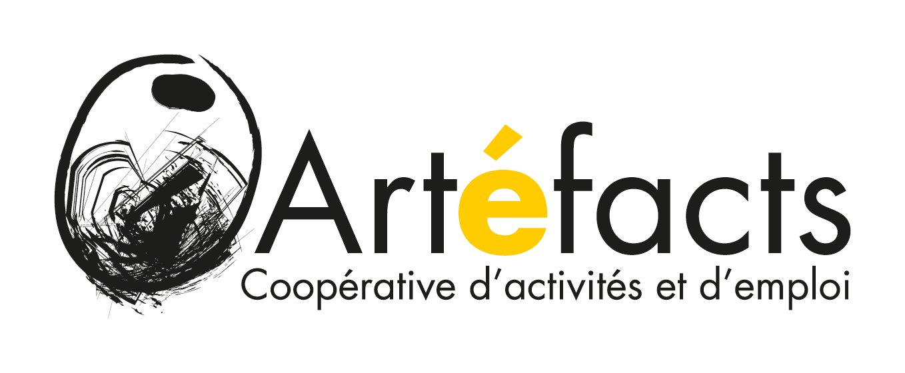

<div class="hero">
  <h1> Néguentropie </h1>
</div>

```html
  
  <figcaption><span>Image <a href="https://pixflowave.fr/">Erwan Bozec</a> réalisé avec <a href="https://www.blender.org/">Blender</a></span></figcaption>
```
## Œuvre

```html
  <div class="card">
    <p>L'Installation artistique <strong><em>Néguentropie</em></strong> se base sur la notion d'art en tant qu'expérience à vivre. C’est une invitation à la recherche du point gris.
    <blockquote>
    <cite>" Paul Klee dit de même, dans un autre langage, que le monde naît du point gris par lui-même chaos. « Le moment cosmogénétique est là : la fixation d’un point gris dans le chaos. » "</cite>
    
    <footer>— Henri Maldiney L’esthétique des rythmes</footer>
    </blockquote>
    Cette recherche se décline concrètement par l'aménagement scénographique et mobilier d'un espace propice à l'expérimentation.
    
    <blockquote><cite>" L’ouvrage peut ouvrir le monde d’un petit jardin, plus ou moins secret, qui constitue un espace singulier par quelqu’un qui y produit ce que, dans un langage scientifique, on appellerait de la néguentropie – de la diversification, de la bifurcation, de l’inattendu, de l’improbable, de l’inespéré. "</cite>
    
    <footer>— B. Stiegler, L’Emploi est mort, vive le travail</footer>
    </blockquote>
    </p>
  </div>
```

### Projection Aireocean | Attracteur étrange de Lorentz

```html
<iframe width="100%" height="564" frameborder="0"
  src="https://observablehq.com/embed/@pixflowave/airocean-attracteur-de-lorentz@710?cells=dual"></iframe>
```

### Schéma partiel du pharmakon ***Néguentropie***
#### Cartographie de bifurcations Noétiques

```html
<iframe width="100%" height="1012" frameborder="0" style="background: transparent;"
  src="https://observablehq.com/embed/@pixflowave/neguentropie?cells=chartz"></iframe>
```

### [Reboute](https://tube.futuretic.fr/c/reboutelatechnologie/videos)

```html
<iframe title="RB_07 Le projet Néguentropie" width="100%" height="500" src="https://tube.futuretic.fr/videos/embed/c44a1628-d1ba-4f47-a5f4-db6e137e0443" frameborder="0" allowfullscreen="" sandbox="allow-same-origin allow-scripts allow-popups"></iframe>
```

---


---

### Néguentropie - 2020
#### Résidence artistique - Artéfatcs

```js
const Néguentropie = [
  "Néguentropie/Aline Perdereau",
  "Néguentropie/Erwan Bozec",
  "Néguentropie/Philippe Rivière",
  "Néguentropie/Luc Léger",
  ]
```

```js
Plot.plot({
  axis: null,
  margin: 25,
  height: 250,
  width: 1000,
  marginRight: 0,
  marginLeft: 150,
  marginBottom: 25,
  marks: [
    () => htl.svg`<defs>
      <linearGradient id="gradient" gradientTransform="rotate(90)">
        <stop offset="15%" stop-color="purple" />
        <stop offset="75%" stop-color="red" />
        <stop offset="100%" stop-color="gold" />
      </linearGradient>
    </defs>`,
    Plot.tree(Néguentropie, {dx: -5, dy: -10, fontSize:12, textLayout: 'normal' ,treeAnchor: 'right', strokeWidth: 2,stroke: "grey",strokeOpacity: 0.5 ,stroke: "url(#gradient)"}),
  ]
    })
         
```

## Rencontres

### [Néguentropie Frontière - 2021](https://do.doc.neguentropie.art/_publications/neguentropie-frontiere/)
#### Atelier de la Morinerie - Tours
[Récit "360"](https://do.doc.neguentropie.art/_publications/neguentropie-fontiere-360/)

```js
const curveBumpX = () => {
  class Bump {
    constructor(context, x) {
      this._context = context;
      this._x = x;
    }
    areaStart() {
      this._line = 0;
    }
    areaEnd() {
      this._line = NaN;
    }
    lineStart() {
      this._point = 0;
    }
    lineEnd() {
      if (this._line || (this._line !== 0 && this._point === 1))
        this._context.closePath();
      this._line = 1 - this._line;
    }
    point(x, y) {
      (x = +x), (y = +y);
      switch (this._point) {
        case 0: {
          this._point = 1;
          if (this._line) this._context.lineTo(x, y);
          else this._context.moveTo(x, y);
          break;
        }
        case 1:
          this._point = 2; // falls through
        default: {
          if (this._x)
            this._context.bezierCurveTo(
              (this._x0 = (this._x0 + x) / 2),
              this._y0 + 1e-3,
              this._x0,
              y,
              x,
              y
            );
          else
            this._context.bezierCurveTo(
              this._x0 + 1e-3,
              (this._y0 = (this._y0 + y) / 2),
              x,
              this._y0,
              x,
              y
            );
          break;
        }
      }
      (this._x0 = x), (this._y0 = y);
    }
  }

  return function bumpX(context) {
    return new Bump(context, true);
  };
}
```
```js
// Cell 2: Create the plot using curveBumpX
Plot.plot({
  axis: null,
  margin: 25,
  height: 250,
  width: 1000,
  marginRight: 0,
  marginLeft: 150,
  marginBottom: 25,
  marks: [
    () => htl.svg`<defs>
      <linearGradient id="gradient" gradientTransform="rotate(90)">
        <stop offset="15%" stop-color="purple" />
        <stop offset="75%" stop-color="red" />
        <stop offset="100%" stop-color="gold" />
      </linearGradient>
    </defs>`,
    Plot.tree(NéguentropieFrontiére, {dx: -5, dy: -10, fontSize:12, textLayout: 'normal' ,treeAnchor: 'right', strokeWidth: 2,stroke: "grey",strokeOpacity: 0.5 ,stroke: "url(#gradient)", curve: curveBumpX()}),
  ]
})
```
```js
const NéguentropieFrontiére = [
  "Néguentropie Frontiére/Mélissa Plet-Whyckhuyse",
  "Néguentropie Frontiére/Aline Perdereau",
  "Néguentropie Frontiére/Erwan Bozec",
]
```

### [Néguentropie](https://do.doc.neguentropie.art/_publications/neguentropie/)
#### La Fabrique de Blois - 2021

```js
Plot.plot({
  axis: null,
  margin: 75,
  height: 250,
  width: 1000,
  marginRight: 0,
  marginLeft: 150,
  marginBottom: 75,
  marks: [
    () => htl.svg`<defs>
      <linearGradient id="gradient" gradientTransform="rotate(90)">
        <stop offset="15%" stop-color="purple" />
        <stop offset="75%" stop-color="red" />
        <stop offset="100%" stop-color="gold" />
      </linearGradient>
    </defs>`,
    Plot.tree(NéguentropieLaFabriqueDeBlois2021, {dx: -5, dy: -10, fontSize:12, textLayout: 'normal' ,treeAnchor: 'right', strokeWidth: 2,stroke: "grey",strokeOpacity: 0.5 ,stroke: "url(#gradient)",curve: curveBumpX()}),
  ]
    })
    
  

```

```js
const NéguentropieLaFabriqueDeBlois2021 = [
  "Néguentropie/Erwan Bozec",
  "Néguentropie/La Fabrique de Blois",
]
```

### [Néguentropie](https://do.doc.neguentropie.art/_publications/neguentropie/)
#### La Fabrique de Blois - 2022

```js
Plot.plot({
  axis: null,
  margin: 25,
  height: 250,
  width: 1000,
  marginRight: 0,
  marginLeft: 150,
  marginBottom: 25,
  marks: [
    () => htl.svg`<defs>
      <linearGradient id="gradient" gradientTransform="rotate(90)">
        <stop offset="15%" stop-color="purple" />
        <stop offset="75%" stop-color="red" />
        <stop offset="100%" stop-color="gold" />
      </linearGradient>
    </defs>`,
    Plot.tree(NéguentropieLaFabriqueDeBlois, {dx: -5, dy: -10, fontSize:12, textLayout: 'normal' ,treeAnchor: 'right', strokeWidth: 2,stroke: "grey",strokeOpacity: 0.5 ,stroke: "url(#gradient)"}),
  ]
    })
         
```

```js
const NéguentropieLaFabriqueDeBlois = [
  "Néguentropie/Anne Alomber",
  "Néguentropie/Erwan Bozec",
  "Néguentropie/Antoine Moreau",
  "Néguentropie/La Fabrique de Blois",
]
```

### [Pour un numérique néguanthropique](https://do.doc.neguentropie.art/_publications/presentation-de-neguentropie-irisa/) - 2023
##### Des technologies pour favoriser la noodiversité
#### Si. — Séance inaugurale - La méthodologie de la singularité - Paris

```js
Plot.plot({
  axis: null,
  margin: 75,
  height: 250,
  width: 1000,
  marginRight: 0,
  marginLeft: 150,
  marginBottom: 25,
  marks: [
    () => htl.svg`<defs>
      <linearGradient id="gradient" gradientTransform="rotate(90)">
        <stop offset="15%" stop-color="purple" />
        <stop offset="75%" stop-color="red" />
        <stop offset="100%" stop-color="gold" />
      </linearGradient>
    </defs>`,
    Plot.tree(Néguanthropique, {dx: -5, dy: -10, fontSize:12, textLayout: 'normal' ,treeAnchor: 'right', strokeWidth: 2,stroke: "grey",strokeOpacity: 0.5 ,stroke: "url(#gradient)",curve: curveBumpX()}),
  ]
    })
```

```js
const Néguanthropique = [
  "Pour un Numérique Néguanthropique/Anne Alomber",
  "Pour un Numérique Néguanthropique/Erwan Bozec",
]
```

### [Méta-Humus - 2023](https://www.msh-vdl.fr/actualite/human-tech-days-meta-humus/)
#### Maison des Sciences de L'homme - Val de de Loire

```js
Plot.plot({
  axis: null,
  margin: 25,
  height: 250,
  width: 1000,
  marginRight: 0,
  marginLeft: 150,
  marginBottom: 25,
  marks: [
    () => htl.svg`<defs>
      <linearGradient id="gradient" gradientTransform="rotate(90)">
        <stop offset="15%" stop-color="purple" />
        <stop offset="75%" stop-color="red" />
        <stop offset="100%" stop-color="gold" />
      </linearGradient>
    </defs>`,
    Plot.tree(MétaHumus, {dx: -5, dy: -10, fontSize:12, textLayout: 'normal' ,treeAnchor: 'right', strokeWidth: 2,stroke: "grey",strokeOpacity: 0.5 ,stroke: "url(#gradient)"}),
  ]
    })
         
```

```js
const MétaHumus = [
  "Méta-Humus/Anne Alombert",
  "Méta-Humus/Erwan Bozec",
  "Méta-Humus/Jean-Paul Thibeau",
  "Méta-Humus/Luc Léger",
]
```

## Bifurcations émergentes 

### [Néguanthropocène](neguanthropocene) - 2021

```js
Plot.plot({
  axis: null,
  margin: 25,
  height: 250,
  width: 1000,
  marginRight: 0,
  marginLeft: 150,
  marginBottom: 25,
  marks: [
    () => htl.svg`<defs>
      <linearGradient id="gradient" gradientTransform="rotate(90)">
        <stop offset="15%" stop-color="purple" />
        <stop offset="75%" stop-color="red" />
        <stop offset="100%" stop-color="gold" />
      </linearGradient>
    </defs>`,
    Plot.tree(Néguanthropocéne, {dx: -5, dy: -10, fontSize:12, textLayout: 'normal' ,treeAnchor: 'right', strokeWidth: 2,stroke: "grey",strokeOpacity: 0.5 ,stroke: "url(#gradient)"}),
  ]
    })
         
```

```js
const Néguanthropocéne = [
  "Néguanthropocène/Camille Guyon Taillens",
  "Néguanthropocène/Jean-Paul Thibeau",
  "Néguanthropocène/Erwan Bozec",
  "Néguanthropocène/Philippe Carré",
  "Néguanthropocène/Manuel Herreno",
  "Néguanthropocène/Olivier Heinry",
]
```

### Habitus - 2021

```js
Plot.plot({
  axis: null,
  margin: 25,
  height: 250,
  width: 1000,
  marginRight: 0,
  marginLeft: 150,
  marginBottom: 25,
  marks: [
    () => htl.svg`<defs>
      <linearGradient id="gradient" gradientTransform="rotate(90)">
        <stop offset="15%" stop-color="purple" />
        <stop offset="75%" stop-color="red" />
        <stop offset="100%" stop-color="gold" />
      </linearGradient>
    </defs>`,
    Plot.tree(Habitus, {dx: -5, dy: -10, fontSize:12, textLayout: 'normal' ,treeAnchor: 'right', strokeWidth: 2,stroke: "grey",strokeOpacity: 0.5 ,stroke: "url(#gradient)",curve: curveBumpX()}),
  ]
    })
    
  

```

```js
const Habitus = [
  "Habitus/Julia Nivan",
  "Habitus/Camille Guyon Taillens",
  "Habitus/Jean-Paul Thibeau",
  "Habitus/Erwan Bozec",
  "Habitus/Benjamin Cadon",
]
```

### Humus - 2022

```js
Plot.plot({
  axis: null,
  margin: 25,
  height: 250,
  width: 1000,
  marginRight: 0,
  marginLeft: 150,
  marginBottom: 25,
  marks: [
    () => htl.svg`<defs>
      <linearGradient id="gradient" gradientTransform="rotate(90)">
        <stop offset="15%" stop-color="purple" />
        <stop offset="75%" stop-color="red" />
        <stop offset="100%" stop-color="gold" />
      </linearGradient>
    </defs>`,
    Plot.tree(Humus, {dx: -5, dy: -10, fontSize:12, textLayout: 'normal' ,treeAnchor: 'right', strokeWidth: 2,stroke: "grey",strokeOpacity: 0.5 ,stroke: "url(#gradient)",curve: curveBumpX()}),
  ]
    })
```

```js
const Humus = [
  "Humus/Laurie Dufrenne",
  "Humus/Laurie Pailler",
  "Humus/Erwan Bozec",
]
```

### Sur le Web
- Publication de Philippe Rivière sur [Observable](https://observablehq.com/@visionscarto/neguentropie) dans le cadre du ***#30DayMapChallenge***
- Inscription des différents projets issus de Néguentropie sur le ***Centre de Ressources pour les Arts et les Cultures - Numériques en région Centre-Val de Loire***, [CRACN Néguentropie](https://cracn.fr/books/neguentropie)
- Publication sur le site [Organoesis](https://organoesis.org/projets-contributifs/neguentropie) suite à la rencontre avec ***Anne Alombert.***
- Publication sur le site [oeuvres.artlibre](https://oeuvres.artlibre.org/neguentropie) suite à la rencontre avec ***Antoine Moreau.***

---
## A Vous de Bifurquer !
### [https://do.doc.neguentropie.art](https://do.doc.neguentropie.art)
---
## [Documentation](https://do.doc.neguentropie.art/_publications/documentation/)
---
## Co-auteur | Néguantropologue

### Erwan Bozec
Artiste | Néguanthropologue d'expériences collectives favorisant “l’être-au-monde” et l’autonomie du citoyen.

[Pixflowave](https://pixflowave.fr/)

### Aline Perdereau
#### Conduite de projet culturel, ingénierie pédagogique

Formée en Arts plastiques à l’université de Rennes, elle fut à la tête d’un service de l’architecture et du patrimoine pendant 5 ans. Dans la coopérative Artefacts jusqu’en 2020, elle a construit et mené plusieurs ateliers d’arts plastiques avec différents publics. Elle a assuré pendant 2 ans la coordination pédagogique de l’école d’art de Blois.

### Philippe Rivière
#### journalisme, code, cartographie

Journaliste et programmeur, il s’intéresse désormais à la cartographie et à la visualisation de données. Il anime le site Internet de réflexion sur les représentations du monde, 

[visionscarto.net](https://visionscarto.net/)

### Luc Léger
#### Créateur numérique et modélisation

De formation initiale en développement informatique, il utilise depuis plus de 10 ans des outils de modélisation 3D. Son parcours mixe à la fois la création d’applications numériques et la réalisation d’objets interactifs.

[Luc Léger](https://www.artefacts.coop/cooperataires/luc-leger/)

#### Erwan BOZEC - Philippe Rivière - Luc Léger - Aline Perdereau, Néguentropie, 2020 
Copyleft: cette œuvre est libre, vous pouvez la copier, la diffuser et la modifier selon les termes de la [Licence Art Libre](http://www.artlibre.org)



[https://artefacts.coop](https://artefacts.coop/)

---

<style>

.hero {
  display: flex;
  flex-direction: column;
  align-items: center;
  font-family: var(--sans-serif);
  margin: 4rem 0 8rem;
  text-wrap: balance;
  text-align: center;
}

.hero h1 {
  margin: 1rem 0;
  padding: 1rem 0;
  max-width: none;
  font-size: 14vw;
  font-weight: 900;
  line-height: 1;
  background: linear-gradient(30deg, var(--theme-foreground-focus), currentColor);
  -webkit-background-clip: text;
  -webkit-text-fill-color: transparent;
  background-clip: text;
}

.hero h2 {
  margin: 0;
  max-width: 34em;
  font-size: 20px;
  font-style: initial;
  font-weight: 500;
  line-height: 1.5;
  color: var(--theme-foreground-muted);
}

@media (min-width: 640px) {
  .hero h1 {
    font-size: 90px;
  }
}

</style>
